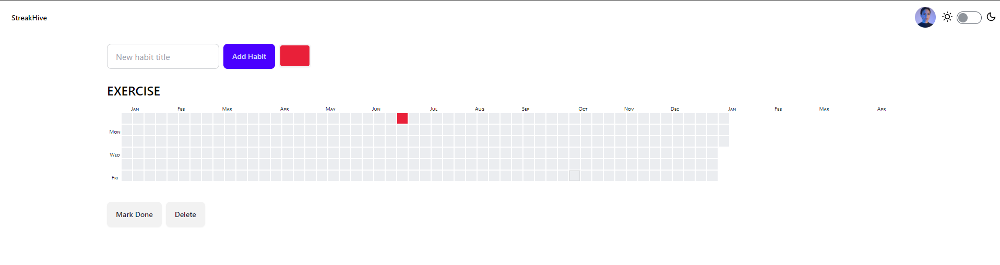

# StreakHive
StreakHive is a habit tracking application that helps you visualize and manage your habits using compact calendar heatmaps. Each habit tracker is color-coded to provide an easy-to-understand overview of your progress.

## Features
Compact Calendar Heatmaps: Visualize your habit progress with small, rectangular calendar heatmaps.
Color-coded Habits: Each habit is color-coded with different color intensities to indicate progress.
Add and Manage Habits: Easily add new habits and manage existing ones with intuitive controls.
Tooltip Information: Hover over calendar cells to see additional information about your habit progress.




## Installation

## To get started with StreakHive, follow these steps:

### Clone the repository:
```bash
git clone https://github.com/SHIV000000/streakhive.git
```
```bash
cd streakhive
```
### Install dependencies:
```bash
npm install
```
### Run the application:
```bash
npm start
```
### The application will start on http://localhost:3000.

## Usage
```
Adding a Habit: Enter a title for the new habit in the input field.
Click the "Add Habit" button to add the new habit to the list.
Done: Mark existing  day as completed.
Color: Change the color theme of the habit tracker.
Delete: Remove the habit from the list.
```

### Visualizing Progress
The calendar heatmap for each habit shows your progress over the  year.
Each cell represents a day, and the color intensity indicates the completion level of the habit for that day.


### Folder Structure
```arduino
streakhive/
├── public/
│   ├── index.html
│   └── ...
├── src/
│   ├── components/
│   │   ├── Navbar.js
│   │   ├── HabitList.js
│   │   └── HabitCard.js
│   ├── App.js
│   ├── index.js
│   └── ...
├── tailwind.config.js
├── postcss.config.js
├── package.json
└── ...
```
### Dependencies
StreakHive uses the following main dependencies:

React: A JavaScript library for building user interfaces.
Tailwind CSS: A utility-first CSS framework for rapid UI development.
DaisyUI: A plugin for Tailwind CSS that provides pre-designed components.
React Tooltip: A library for adding tooltips to your React application.


Contributing
Contributions are welcome! If you have any ideas, suggestions, or issues, please open a pull request or an issue on the GitHub repository.

# Happy tracking with StreakHive! 🚀


